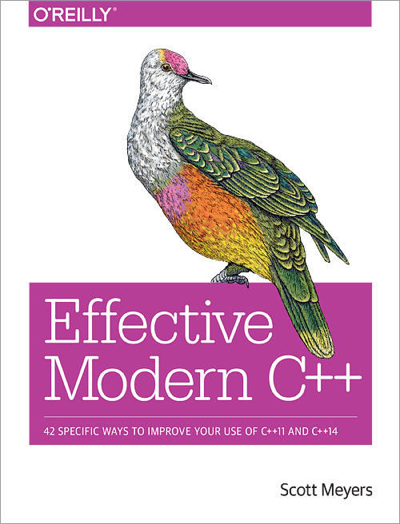

<!-- _class: lead -->

<div class="row center-xs middle-xs around-xs">
<div class="col-xs">


</div>
<div class="col-xs-8">

# Core Guidelines
*use modern C++ effectively*
</div>
</div>
Stefan Kerkmann

---

<div class="row middle-xs">
<div class="col-xs">


Bjarne Stroustrup
</div>
<div class="col-xs">

* > C makes it easy to shoot yourself in the foot; C++ makes it harder, but when you do it blows your whole leg off.

</div>
</div>

---

<!-- _class: invert -->

## Agenda

Errors and Maintainability Pitfalls
History of C++ Standards
Reasoning about a solution

—

Goals and Overview of C++ Core Guidelines
**Applied Examples**

—

Tools
Conclusion
Q&A

---

<style scoped>
section { text-align: left; }
</style>

<div class="row">
<div class="col-xs">

## Errors

+ Memory Management
    + Resource leaks
    + Use-after free
    + Double free
+ Concurrency
    + Data races
    + Deadlocks
+ Mutability
+ Uninitialized Variables

</div>
<div class="col-xs">

## Maintainability

+ Weak Typing
+ Code Noise
+ Code Reuse
+ Referential Transparency
+ 10² Language Features
+ 10³ Ways to solve a problem
<br>

#### to be continued...

</div>
</div>

---

## C++ Standards

| Year | C++ Standard | Informal name |
| - | - | - |
| 1979 | None | C with Classes |
| 1983 | *CFront 1.0* | C++ 1.0 |
| 1989 | *CFront 2.0* | C++ 2.0 |
| 1998 | ISO/IEC 14882:1998[23] | C++98 |
| 2003 | ISO/IEC 14882:2003[24] | C++03 |
| 2011 | ISO/IEC 14882:2011[25] | C++11, C++0x |
| 2014 | ISO/IEC 14882:2014[26] | C++14, C++1y |
| 2017 | ISO/IEC 14882:2017[9] | C++17, C++1z |
| 2020 | to be determined | C++20[17], C++2a |


---

<!-- _class: invert -->

## Looking for a solution to a preventable problem

---


<div class="row middle-xs">
<div class="col-xs">


Erik Naggum
</div>
<div class="col-xs">

* > I believe C++ instills fear in programmers, fear that the interaction of some details causes unpredictable results [...] but the solution should have been to create and use a language that does not overload the whole goddamn human brain with irrelevant details.

</div>
</div>

---

<div class="row middle-xs">
<div class="col-xs">


Bjarne Stroustrup
</div>
<div class="col-xs">

* > Within C++, there is a much smaller and cleaner language struggling to get out.

</div>
</div>

---

<!-- _class: invert -->

## But no radical solution is viable

* Sheer amount of code bases written since 1983
* Keeping Backwards compatibility
* Reshaping the whole language is not an option

---

## C++ Core Guidelines - Goals

* Use modern C++ features
* Produce code that is
    * Type safe 🧷
    * Exhibits no resource leaks ☔
    * Catches common logic errors 👮
    * Runs fast! 🏃‍
    * Emphasizes simplicity and safety :thumbsup:
* Suitable for gradual introduction into existing code bases
* Be enforceable by machines 🤖

<!--
Pragmatic approach: incremental improvement

 The aim of this document is to help people to use modern C++ (C++17) effectively.
Open for development by the community, Feedback vital and appreciated
The rules are meant for gradual introduction into a code base. We plan to build tools for that and hope others will too.
Our initial set of rules emphasizes safety (of various forms) and simplicity.
Many of the rules are designed to be supported by an analysis tool. Violations of rules will be flagged with references (or links) to the relevant rule. We do not expect you to memorize all the rules before trying to write code. -->

---

## Overview

<style scoped>
p {
flex-basis: 50%;
max-width: 50%;
text-align: left;
}
</style>

<div class="row between-xs">

I: Interfaces

F: Functions

C: Classes and class hierarchies

Enum: Enumerations

**R: Resource management**

ES: Expressions and statements

Per: Performance

CP: Concurrency and parallelism

E: Error handling

**Con: Constants and immutability**

CPL: C-style programming

SF: Source files

SL: The Standard Library

T: Templates and generic programming
</div>

---

<!-- _class: invert -->

<style scoped>
li { text-align: center; }
</style>

# Showtime 🥳

---

# Con: Constants and immutability

<style scoped>
p { text-align: left; }
</style>

<!-- You can’t have a race condition on a constant. It is easier to reason about a program when many of the objects cannot change their values. Interfaces that promises “no change” of objects passed as arguments greatly increase readability. -->


Con.1: By default, make objects immutable

Con.2: By default, make member functions `const`

Con.3: By default, pass pointers and references to `const`s

Con.4: Use `const` to define objects with values that do not change after construction

Con.5: Use `constexpr` for values that can be computed at compile time

---

## Bad :poop:


<div class="row">
<div class="col-xs">

```cpp
struct
Person {
    DivineEternity
    LastJudgement(std::vector<Person*> family)
    {
        // Here be dragons
    }
};
```

</div>
<div class="col-xs">

* Pass by value
* Mutation of me or my family? 🧟‍
* Might throw a `GoToHellException` :fire:

</div>
</div>

---

## Better

<!-- An expression is called referentially transparent if it can be replaced with its corresponding value without changing the program's behavior.[1] This requires that the expression is pure, that is to say the expression value must be the same for the same inputs and its evaluation must have no side effects. An expression that is not referentially transparent is called referentially opaque.  -->

<div class="row">
<div class="col-xs">

```cpp
struct
Person {
    DivineEternity
    LastJudgement(const std::vector<const Person*>& family)
    const noexcept
    {
        // Here be dragons
    }
};
```
</div>

<div class="col-xs">

* Easier to reason about
* A lot of code noise
* Opt-in rather than Opt-out

</div>
</div>

---

<style scoped>
p { text-align: left; }
</style>

# R: Resource management

R.1 Manage resources automatically using resource handles and RAII

R.20 Use `unique_ptr` or `shared_ptr` to represent ownership

R.11 Avoid calling `new` and `delete` explicitly

<!-- This section contains rules related to resources. A resource is anything that must be acquired and (explicitly or implicitly) released, such as memory, file handles, sockets, and locks. The reason it must be released is typically that it can be in short supply, so even delayed release may do harm. The fundamental aim is to ensure that we don’t leak any resources and that we don’t hold a resource longer than we need to. An entity that is responsible for releasing a resource is called an owner.

There are a few cases where leaks can be acceptable or even optimal: If you are writing a program that simply produces an output based on an input and the amount of memory needed is proportional to the size of the input, the optimal strategy (for performance and ease of programming) is sometimes simply never to delete anything. If you have enough memory to handle your largest input, leak away, but be sure to give a good error message if you are wrong. Here, we ignore such cases. -->

---

<!-- _class : invert -->

# R.1 Manage resources automatically using resource handles and RAII

---

<!-- Note usage of C-Style FILE instead of C++ fstream API for demonstration purposes -->

## Bad :poop:

<div class="row">

<div class="col-xs">

```cpp
void func()
{
    File* d_fP = fopen("/etc/passwd", "r");
    if(d_fp == nullptr){
        // do error things
    }

    char line[512];
    while(fgets(line, sizeof(line), d_fp)) {
        // do things with line
    }

    {
        more code - maybe with early returns
        exceptions, threads...
    }

    if(d_fp != nullptr){
        fclose(d_fp);
    }
}
```
</div>

<div class="col-xs">

* Did we cover all cases and closed the file handle?
* What about exceptions thrown in called procedures?
* We will have a ressource leak 💦

</div>
</div>

---

## Use RAII

<div class="row">

<div class="col-xs">

```cpp
struct SmartFP
{
    SmartFP(const char* fname, const char* mode)
    {
        d_fp = fopen(fname, mode);
    }
    ~SmartFP()
    {
        if(d_fp != nullptr) {
            fclose(d_fp);
        }
    }
    FILE* d_fp;
};
```

</div>

<div class="col-xs">

* Aquire or allocate resource handle in constructor
* Release resource handle in destructor
* Lifetime of handle is bound to lifetime of the owning object ⏰

</div>
</div>

<!-- If there are no object leaks then there are no resource leaks -->

---

## Better

<div class="row">
<div class="col-xs">

```cpp
void func() {
    SmartFP fp {"/etc/passwd", "r"};
    if(fp.d_fp == nullptr) {
        // do error things
    }

    char line[512];
    while(fgets(line, sizeof(line), fp.d_fp)) {
        // do things with line
    }

    {
        more code - maybe with early returns
        exceptions, threads...
    }

    // note, no fclose
    }
```

</div>
<div class="col-xs">

* :thumbsup: The FILE pointer will never leak due to destruction. 
* :thumbsup: Closing is deterministic and in a single place
* 💥 Vurnerable to "use after free" errors due to possible copy

</div>
</div>

---

<!-- _class: invert -->

### R.20: Use `unique_ptr` or `shared_ptr` to represent ownership

<!--
The pointer returned by new should belong to a resource handle (that can call delete). If the pointer returned by new is assigned to a plain/naked pointer, the object can be leaked.

Mention that those are smart pointers. Short note of weak_ptr. std lib is memory.
 -->

---

### Good `std::unique_ptr`

<div class="row">

<div class="col-xs">

```cpp
void func() {
    std::unique_ptr<FILE, int (*)(FILE*)> fp_uni(
        fopen("/etc/passwd", "r"),
        fclose
    );

    if(fp == nullptr) {
        // do error things
    }

    char line[512];
    while(fgets(line, sizeof(line), fp)) {
        // do things with line
    }

    {
        more code - maybe with early returns
        exceptions, threads...
    }

    // note, no fclose
    }
```

</div>
<div class="col-xs">

* Single owner
* Copying is prohibited
* Can be moved 
* Same size as raw pointer
* Automatically destroyed when out of scope
* Acts like a normal pointer
* # :thumbsup:

</div>
</div>

---

### Good `std::shared_ptr`

<div class="row">
<div class="col-xs">

```cpp
void func() {
    std::shared_ptr<FILE> fp(
        fopen("/etc/passwd", "r"),
        fclose
    );

    if(fp == nullptr) {
        // do error things
    }

    char line[512];
    while(fgets(line, sizeof(line), fp)) {
        // do things with line
    }

    {
        more code - maybe with early returns
        exceptions, threads...
    }

    // note, no fclose
    }
```

</div>
<div class="col-xs">

* Multiple owners
* Copying and moving is allowed
* Keeps internal reference count to track usage
* Size for counter, deleter and pointer
* Acts like a normal pointer
* # :thumbsup:

</div>
</div>

---

<!-- _class: invert -->

### R.11 Avoid calling `new` and `delete` explicitly

---

### Okay

<div class="row">
<div class="col-xs">

```cpp
void func() {
    // setup

    auto taxi_1 = new Taxi(7.2e-2, 0.7, 75, 0.0);
    auto taxi_2 = new Taxi(12.5e-2, 0.95, 90, 0.0);
    
    std::vector<Taxi*> taxis;
    taxis.push_back(taxi_1);
    taxis.push_back(taxi_2);
    
    UI.start(taxis);
    
    // do bookings, fill up gas

    // Never forget to clean up...
    delete taxi_1;
    delete taxi_2;
}

```

</div>

<div class="col-xs">

* Manual Memory Management is tedious and error prone
* Unnessesary copies of pointers

</div>
</div>

---

### Good

<div class="row">
<div class="col-xs">

```cpp
void func() {
    // setup

    std::vector<std::unique_ptr<Taxi>> taxis;
    taxis.emplace_back(
        std::make_unique<Taxi>(7.2e-2, 0.7, 75, 0.0)
    );
    taxis.emplace_back(
        std::make_unique<Taxi>(12.5e-2, 0.95, 90, 0.0)
    );
    
    UI.start(taxis);
    // do bookings, fill up gas
    
    // Everything is deleted automatically
}

```

</div>

<div class="col-xs">

* Noisy but comfortable
* Memory efficent
* Clear ownership
* No ressource leak 💦

</div>
</div>

---

## Linters - Tooling

### `clang-tidy` *CLion VS 2013+*

Clang-tidy has a set of rules that specifically enforce the C++ Core Guidelines. These rules are named in the pattern `cppcoreguidelines-*.`

### `CppCoreCheck` *VS 2015+*

The Microsoft compiler’s C++ code analysis contains a set of rules specifically aimed at enforcement of the C++ Core Guidelines.

---

<!-- _class: invert -->

# Bonus!

---

## `clang-format`

Automatic source code formatting following defined style rules.

---

## Before

```cpp
std::string Taxi::getState( ) const noexcept{
    std::ostringstream state;
    state << getName() << " >> "
    << std::fixed <<
    std::setprecision(2)
    << std::setfill(' ') <<
    std::setw(7) <<
    m_Mileage <<
    " km, " <<
    std::setw( 7 ) << m_GasLevel
    << " l, " << std::setw(
        7) << m_Balance
        << " Euro" << std::endl;
    return
    state.str();}
```

---

## After

```cpp
std::string Taxi::getState() const noexcept
{
    std::ostringstream state;
    state << getName() << " >> " << std::fixed << std::setprecision(2)
          << std::setfill(' ') << std::setw(7) << m_Mileage << " km, "
          << std::setw(7) << m_GasLevel << " l, " << std::setw(7) << m_Balance
          << " Euro" << std::endl;
    return state.str();
}
```

---

<style scoped>
.emoji{
    width: 300px;
    height: 300px;
}
</style>

 :relieved:

---

<!-- _class: invert -->

# Conlusion

* Writing safe, reliable and maintainable C++ is difficult
    * Practice
    * Care
    * Experience

* C++ has shortcomings that cannot be fixed soon

* ### Guidelines and tools are there to help ☝️

---

# Please use them

* ### `You won't regret it`

---

<!-- _class: invert -->

# Thank you for listening! :beers:

---

# Further Information

<div class="row center-xs middle-xs around-xs">
<div class="col-xs">



</div>
<div class="col-xs">


</div>
<div class="col-xs">


</div>
</div>
<div class="row center-xs top-xs around-xs">
<div class="col-xs">
<h6>

[Scott Meyers: <br> Effective Modern C++](http://shop.oreilly.com/product/0636920033707.do)
</h6>
</div>
<div class="col-xs">
<h6>

[C++ Core Guidelines](http://isocpp.github.io/CppCoreGuidelines/CppCoreGuidelines)
</h6>
</div>
<div class="col-xs">
<h6>

[Modern C++ Features](https://github.com/AnthonyCalandra/modern-cpp-features)
</h6>
</div>
</div>